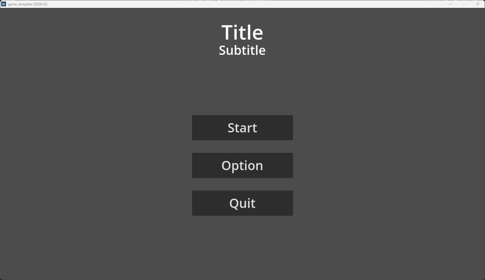

# Godot-GameTemplate-Menu
Currently, most of the Godot tutorials and templates are developed using gdscript. I created this repository to help people who want to develop games with C#, especially those who are transitioning from Unity to Godot.
## Contents
* A simple main menu and scene switch method.
  
    
* An option menu for video and audio settings.
* AudioManager for music and sound effects.
* Save and load the options as .ini configuration file.
  
    
* A simple pause panel for gameplay scenes.
  
    
## How to use
* Clone the project and open .project file with Godot 4.3.
* No addons or plugins are required.
